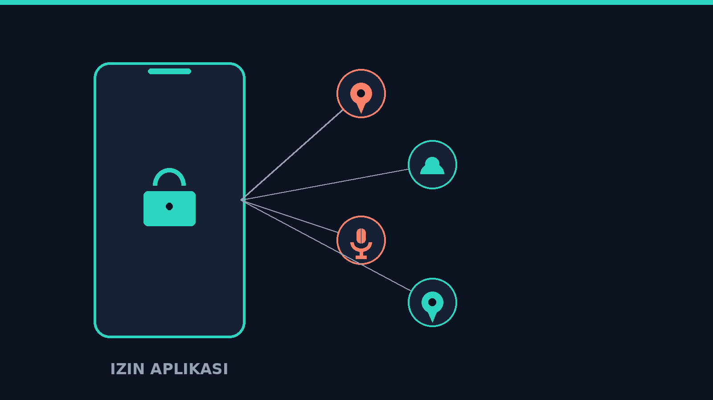
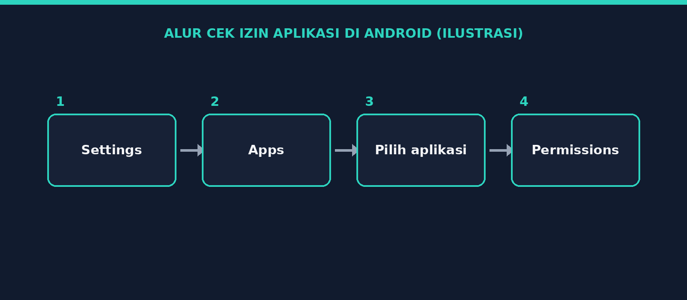
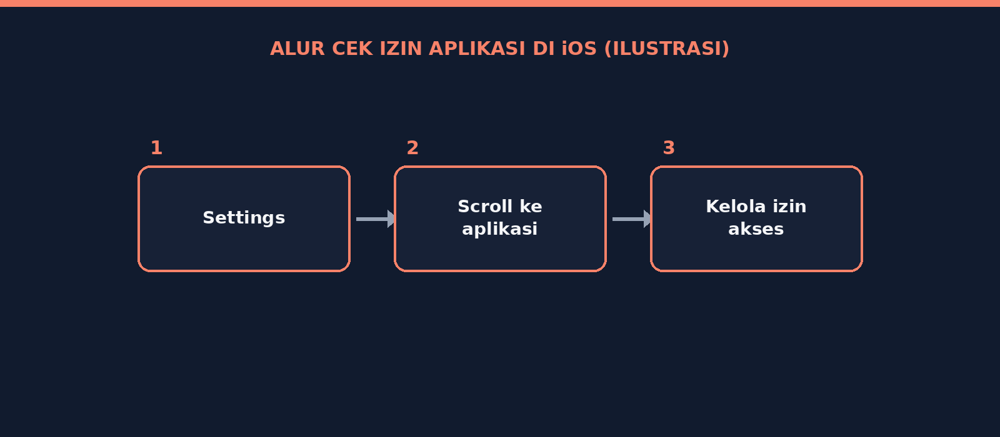
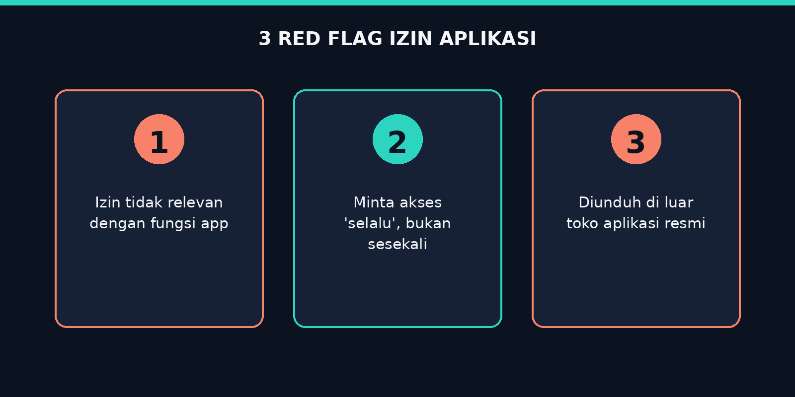

# Judul Artikel

## Ringkasan
Tulis 2-3 kalimat ringkasan singkat tentang topik artikel ini — apa yang dibahas dan kenapa penting.



## Latar Belakang / Konteks
Jelaskan konteks atau latar belakang topik. Misalnya: dari mana kamu belajar ini, kasus apa yang mendasari, atau kenapa kamu menulis catatan ini.

## Tools yang Digunakan
- Tool 1
- Tool 2
- Tool 3

## Pembahasan / Langkah-Langkah
Bagian utama artikel. Bisa berupa penjelasan konsep, atau langkah-langkah teknis kalau ini writeup/tutorial.

### Langkah 1: [Judul langkah]
Penjelasan detail langkah pertama.

```bash
# contoh command jika ada
command --contoh
```


*Gambar 1: Deskripsi singkat apa yang ditunjukkan screenshot ini.*

### Langkah 2: [Judul langkah]
Penjelasan detail langkah kedua.


*Gambar 2: Deskripsi singkat apa yang ditunjukkan screenshot ini.*

<!-- Kalau butuh atur ukuran gambar, pakai tag HTML seperti ini: -->
<!--  -->

## Temuan / Hasil
Apa hasil akhirnya? Kalau ini CTF writeup, tulis flag atau solusinya di sini. Kalau catatan konsep, ringkas poin pentingnya.



## Kesimpulan
Rangkum pelajaran utama dari artikel ini dalam beberapa kalimat.

## Referensi
- [Judul referensi 1](https://contoh-link.com)
- [Judul referensi 2](https://contoh-link.com)
